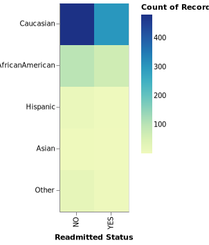
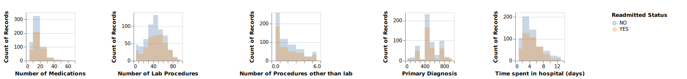
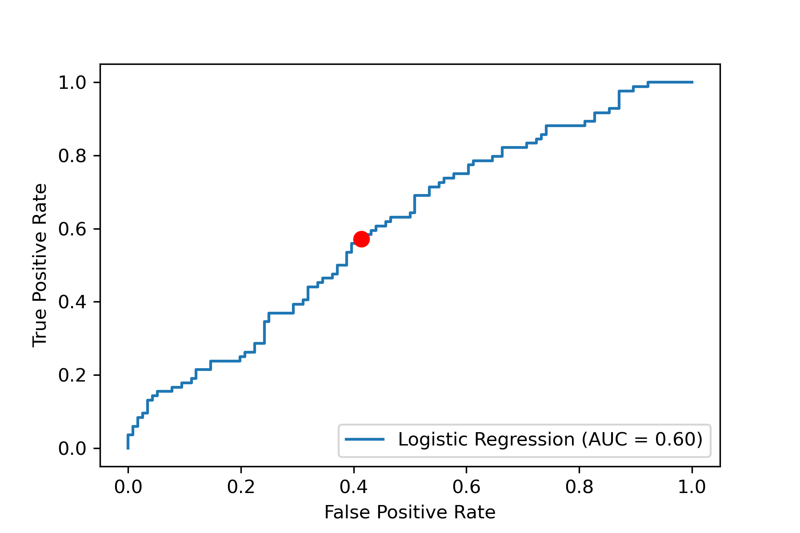

```{r setup, include=FALSE}
knitr::opts_chunk$set(echo = TRUE)
library(knitr)
library(tidyverse)
```

# Summary

This project builds a classification model using logistic regression to analyze various features related to the care of the diabetic patients to predict whether or not the patient will be readmitted to the hospital again. 

# Introduction

For this project, we are trying to answer the predictive question: Given a diabetic patient’s demographic, medication history and management of diabetes during hospital stay, can we predict if they will be readmitted to the hospital or not? 

Due to COVID-19, it is critical to reduce the burden on the health care system and prevent readmission rates from increasing to make space for COVID-19 cases. Our predictor aims to look at the diabetes management and diagnosis during a patient’s hospital stay to understand how much this affects their readmission. Analysis with machine learning models will identify features more likely to predict patient readmission so that hospital management has an idea of where to improve their protocols to better manage diabetic patients during their hospital stay to provide effective care and prevent readmission during this critical time.

# Methods

The R programming language [@R] and Python programming language [@Python] were used to perform the analysis. The following R and Python packages were also used to perform the analysis:

* knitr [@knitr]
* tidyverse [@tidyverse]
* numpy [@Numpy]
* pandas [@Pandas]
* altair and altair_saver [@Altair]
* hashlib [@Hashlib]
* matplotlib [@Matplotlib]
* iPython [@iPython]
* scikit [@Scikit]
* requests [@Requests]
* zipfile [@Zipfile]
* urllib [@Urllib]
* io [@io]
* pandas profiling [@pp]

For statistical analysis specifically:

* StackOverflow [@DSCI571Stack]
* store_vals_function [@DSCI571Var]
* plot formatting [@DSCI531Joel] 

The code used to perform the project and create this report can be found [here](https://github.com/UBC-MDS/group29).

## Data

The data are submitted on behalf of the Center for Clinical and Translational Research, Virginia Commonwealth University, a recipient of NIH CTSA grant UL1 TR00058, and a recipient of the CERNER data. This dataset was collected from 1998-2008 among 130 hospitals and integrated delivery networks throughout the United States of America. 

This data set was sourced from the UCI Machine Learning Repository [@UCI] and can be found [here](https://archive.ics.uci.edu/ml/datasets/diabetes+130-us+hospitals+for+years+1999-2008#). Research from this collected data was used to assess diabetic care during hospitalization and determine if patients were likely to be readmitted or not. The paper by [@paper] can be found [here](https://www.hindawi.com/journals/bmri/2014/781670/). Each row corresponds a unique encounter with a diabetic patient, totaling 74,036,643 unique encounters. Details about each column feature of information collected during these unique encounters can be found [here](https://www.hindawi.com/journals/bmri/2014/781670/tab1/). 

A subset of the data (1000 samples) was used for exploratory data analysis and model testing for the purposes of improving the efficiency and speed of the analysis. We have noted in future improvements that with accessibility to more powerful machinery, we will take full advantage of the large dataset.

## Analysis

After data cleaning, machine learning model logistic regression was tested against radial basis function kernel with support vector machine (RBF SVM) and a baseline dummy classifier method. Logistic regression was determined as the best model in terms of fit and score time, accuracy, and f1 score. Continuing with logistic regression, different parameters were optimized and our model was then used to predict diabetic patient readmission (found in the readmitted target column of the data set). The code used to perform the analysis can be found [here](https://github.com/UBC-MDS/group29/tree/main/src).

# Results and Discussion

Through exploratory data analysis, we determined that some of the features were not informative to answering our question or contained many missing values. Feature information was confirmed through Pandas Profiling which can be found [here](https://github.com/UBC-MDS/group29/blob/main/reports/figures/pandas_profiling.html).

Before model testing, data cleaning was done to address the findings of  non-informative features, class imbalance, NAN values, and duplicate encounters, and this code can be found [here](https://github.com/UBC-MDS/group29/blob/main/src/processingdata.py). Non informative features included encounter id and patient number as those were entirely unique values. We removed weight, payer_code, medical_speciality, examide and citoglipton because much of the information was missing or all values in the column were the same. We were unsure about the race columns as majority of the patients were Caucasian and we did not want to add any racial biases to the data. As shown below, the distribution of race was reviewed to determine that there was no significant difference between different races in patient readmission and therefore the race column was removed from our analysis to prevent any bias.

```{r race_figure, echo=FALSE, fig.cap="Figure 1. Distribution of Race and Readmission Status", out.width = '40%', fig.align = 'center'}

```

Several of the numerical features were reviewed by plotting the distribution of the feature for the two different target classes against each other and found the primary diagnosis of the patient, days spent in hospital, number of medications taken and the frequency of lab procedures to be most informative of predicting readmission status. The importance of the primary diagnosis feature is that if the initial diagnosis is diabetes perhaps patients received better care during their first encounter and thus do not get readmitted [@paper].

```{r numeric_features, echo=FALSE, fig.cap="Figure 2. Distribution of Numeric Features and Readmission Status", fig.align='center', out.width = '100%'}

```

Several of the categorical features were also reviewed in a similar format to the numerical features analysis, and found that metformin, insulin, and Hemoglobin A1C levels were most informative of predicting readmission status. Testing for hemoglobin levels may have resulted in applicable changes to the medications and thus better management of diabetes during their hospital stay, preventing readmission [@NI]. 

```{r categorical_features, echo=FALSE, fig.cap="Figure 3. Distribution of Categorical Features and Readmission Status", fig.align='center', out.width = '100%'}

```

After exploratory data analysis and data cleaning, machine learning models were tested with our data set, and logistic regression (with equal importance assigned to both classes) was determined as the best model to move forward with in our analysis based on fit and score time, accuracy, and f1 scores as shown in Table 1. Fit and score time were chosen as evaluation metrics because the data set was quite large although we took a subset, and it was important to ensure the analysis would fit and score promptly. Accuracy and f1-score were also metrics used to evaluate our models on because accuracy determined the number of predictions our model predicted correctly, and f1-score further analyzes accuracy by combining precision and recall scores. From the scores in Table 1, we can see that logistic regression (balanced) had the highest test and train accuracy scores, as well as test and train f1-scores. Although the fit and score times of logistic regression (balanced) were the slowest, they were only slightly slower from the other models tested. The code used to perform machine learning can be found [here](https://github.com/UBC-MDS/group29/blob/main/src/explore_script4.py). 

```{r classifier_scores, warning = FALSE, message = FALSE, echo=FALSE, out.width = '100%', fig.align='center', fig.width=5}
classifier_scores <- read_csv("../reports/figures/script4_classifier_scores.csv") 
classifier_scores_tidy <- as.data.frame(classifier_scores) %>%
  rename(Models = X1)
knitr::kable(classifier_scores_tidy, caption = "**Table 1. Classifier Models and Their Associated Times and Scores**") %>% 
  kableExtra::kable_styling(bootstrap_options = c("striped", "hover", "condensed","responsive")) 
```

Different parameters of the models were optimized and identified potential improvements for our model in future use. From the confusion matrix, we can see that there is a high amount of false positives and false negatives. From the receiver operating characteristic curve with area under the curve (ROC curve with AUC), and the red point showing our threshold at 0.5, our model is performing at 0.54 where AUC = 1.0 is a perfect classification. These results suggest that our model could be improved by choosing a different classifier or testing other scoring methods for our optimization besides f1-score. Our model performed much lower on the testing data than on the training data, and will therefore require improvements before implementation on deployment data for use in clinical studies. Details about these improvements can be found in the [Future Improvements] section of this report. 


```{r confusion_matrix, echo=FALSE, fig.cap="Figure 4. Confusion Matrix and ROC AUC Curve Results From Logistic Regression (Balanced)", fig.show='hold',fig.align='center', out.width = '50%'}
knitr::include_graphics("../reports/figures/script4_confusion_matrix.png")

```


Completing our analysis using our model on test data, the top 10 features most indicative of patient readmission were found by having the highest associated coefficients as shown in Table 2. These results suggest the health care system begin implementing changes in these specific features, particularly in admission type ID, in order to manage diabetic patient readmission more effectively. 


```{r script4_coefficients_tidy, warning = FALSE, message = FALSE, echo=FALSE, out.width = '50%'}
script4_coefficients <- read_csv("../reports/figures/script4_coefficients.csv") 
script4_coefficients_tidy <- as.data.frame(script4_coefficients) %>%
  rename(Features = X1)
knitr::kable(script4_coefficients_tidy, caption = "**Table 2. Top 10 Features Most Indicative of Patient Readmission**") %>% 
  kableExtra::kable_styling(bootstrap_options = c("striped", "hover", "condensed","responsive"))

```

# Future Improvements

To improve our model in the future to further analyze patient readmission, we can recommend three main suggestions. First, rather than subsetting our data to take a representative and random sample of 1000, we can take a larger subset or even use our entire data set of roughly 70,000 observations. In future models, the use of a larger data set will provide more accurate predictions, reduce bias, and identify outliers that may skew our results. Second, other classifier models such as random forest could be used to test against our logistic regression model to improve predictions. The use of logistic regression assumes there is a linear relationship between the independent and dependent variables, which may not be the case in our project. Random forest is non-parametric and will bypass this linearity assumption associated with logistic regression. Third, our model analyzes a binary classification of readmission although the original data set was a multi-classification of readmission (not readmitted, readmitted for less than 30 days, readmitted for more than 30 days). By using a multi-classification model instead, we can generate a more specific prediction and analyze the severity of features related to readmission time, making our conclusions more informative to improving the health care system.

# References


